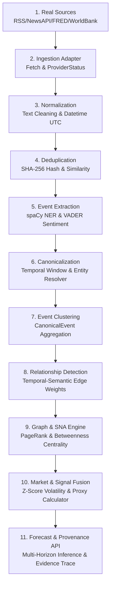

# GeoCap-X System Architecture & Technical Specifications

## 1. Monorepo Structure

```
├── apps/
│   ├── api/          # NestJS 10 API Gateway (TypeScript)
│   ├── web/          # Next.js 15 App Router Frontend (React 19)
│   └── ai/           # FastAPI AI & NLP Inference Engine (Python 3.11/3.14)
├── packages/
│   ├── shared/       # Shared DTOs, interfaces, permissions, and constants
│   ├── ui/           # Shared Glassmorphism React Component Library
│   └── config/       # Shared TypeScript & ESlint configurations
└── docs/             # Technical specifications, methodology & user guides
```

---

## 2. 11-Tier Intelligence Pipeline Architecture



---

## 3. Subsystem Breakdown & Component Responsibilities

1. **Next.js 15 Web Frontend (`apps/web`)**: React 19 Client components rendering real-time dashboard analytics, interactive NetworkX graph visualizations, technical charts, and point-in-time validation reports.
2. **NestJS API Gateway (`apps/api`)**: High-concurrency TypeScript backend managing RBAC authentication, JWT session lifecycle, organization multi-tenancy, rate throttling (`@nestjs/throttler`), and API orchestration.
3. **FastAPI AI & NLP Microservice (`apps/ai`)**: Async Python 3.11 runtime managing real-world source ingestion, spaCy NLP entity extraction, NetworkX SNA centrality computation, statistical abnormality detection, and multi-horizon capital flow inference.
4. **PostgreSQL 15 Database (Neon AWS Cloud)**: Primary relational data store managing user accounts, raw feeds, extracted events, canonical clusters, event chains, predictions, evidence logs, and backtesting snapshots.
5. **Redis 7 & BullMQ**: Caching layer and background job queue orchestrating asynchronous source fetching and periodic network graph re-indexing.
6. **External Provider Adapters (`apps/ai/providers/`)**: Modular connectors interfacing with Yahoo Finance, World Bank REST API, FRED API, and NewsAPI feeds with graceful fallback handling (`NOT_CONFIGURED`).

---

## 4. Security & Data Governance Controls

1. **Authentication & Token Lifecycle**: JWT Access Tokens paired with HttpOnly Refresh Token Cookies, Argon2 password hashing, and role-based access control (RBAC).
2. **Rate Limiting**: Multi-tiered rate limiting via API Gateway Throttler and Nginx reverse proxy configuration.
3. **Data Integrity & Traceability**: Immutable content hashing for raw items, timezone-aware UTC datetime fields, and 10-tier provenance traceability logging.
